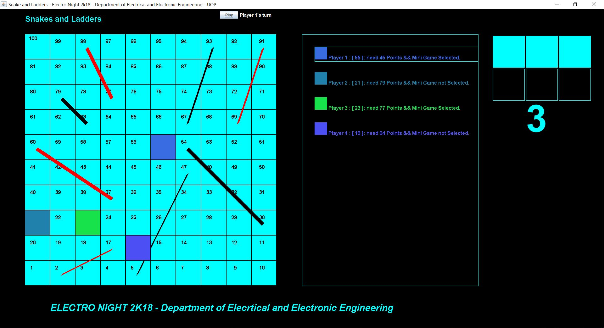

# snakes-and-ladders
java based 2D game

The game *[Snakes and Ladders](https://github.com/DarshanaUOP/snakes-and-ladders/blob/master/out/artifacts/paintHelp_jar/paintHelp.jar)* was developed by using java swing.
It can play upto 5 players 

The figure 1 bellow shows home page of the game. 
 
Figure 1 : Home page of the game 

And Figure 2 shows GameBoard of the game 
Red colored lines considerd as snakes and black colored lines are considering ladders 

 
Figure 2 : UI of the game  

*Note* : _Some functions should have to update._
